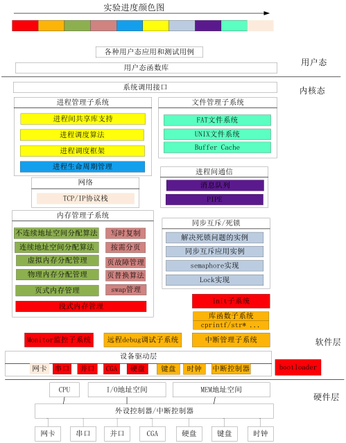

# OS-programming
programming when learning undergraduate-level operating system course
## Main Course
14-week theorical lesson
### Textbook
[《操作系统概念》（第七版）](https://book.douban.com/subject/4289836/)
### Resources
- [*Operating System Concepts*](https://it325blog.files.wordpress.com/2012/09/operating-system-concepts-7-th-edition.pdf), 7th edition
  - alternative downloading: link：https://pan.baidu.com/s/1SZelYI7-1PYGAimN78DxqQ passcode：26ko 
- [*Operating System Concepts*](data/[Operating.System.Concepts(9th,2012.12)].Abraham.Silberschatz.文字版.pdf), 9th edition
- Official [lecture slides](http://bcs.wiley.com/he-bcs/Books?action=resource&bcsId=2217&itemId=0471694665&resourceId=5004) (for 7th edition)
- [Solutions to Practice Exercises](data/Operating_System_Concepts_7th_edtion_Solution_Manual.pdf) (for 7th edition)
- [C and Java Source Code](https://github.com/greggagne/OSC9e) (for 9th edition)
- Other official [online resources](http://os-book.com/OS9/index.html) (for 9th edition)
### Assignments (based on 9th edition / 7th edition)
1. Programming implementations (of example programs in this book)
2. Programming problems
3. Programming projects
## Extra Course
8 labs
### Platform
[*ucore*](https://github.com/chyyuu/ucore_os_lab), a simple Unix-like teaching operating system, [redesigned](http://os.cs.tsinghua.edu.cn/oscourse/OS2019spring) by Tsinghua University, [based](https://pdos.csail.mit.edu/6.828/2012/xv6.html) on *xv6* from MIT and [released](http://www.xuetangx.com/courses/course-v1:TsinghuaX+30240243X+sp/info) in xuetangx.com.
### Manual
[ucore_os_docs (2017)](https://chyyuu.gitbooks.io/ucore_os_docs/content/) on gitbook
### Assignments
gradually implement a tiny X86-32 OS in 10000-line C codes, including
- 0200~1800 Lines **Boot/Protect Mode/Stack/Interrupt**
- 1800~2500 Lines **Physical Memory Management**                       
- 2500~3200 Lines **Virtual Memory Management**                        
- 3200~3600 Lines **Kernel Thread Management**                         
- 3600~4300 Lines **User Process Management**                          
- 4300~5100 Lines **Processor Scheduling**                             
- 5100~6400 Lines **Process Synchronization/Mutex**                    
- 6400~9999 Lines **File System**                                

